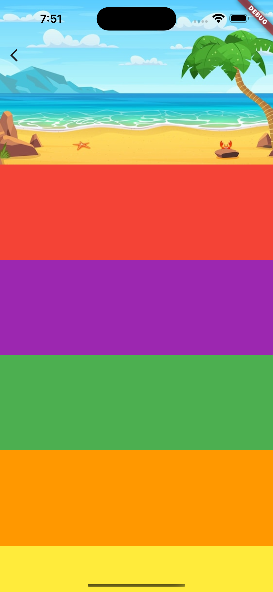

# Flutter Widgets Usage Examples

A collection of examples showcasing the usage of various widgets in Flutter. This repository provides code samples and demonstrations to help developers understand and utilize different widgets effectively.

<p>
     
    
    
</p>

## Introduction

This repository aims to provide developers with practical examples and demonstrations of popular widgets in Flutter. Each example is well-documented and comes with detailed explanations to help you understand the widget's purpose, properties, and how to use it in your own projects.

## Installation

To use these examples, make sure you have Flutter installed on your machine. If you haven't installed Flutter yet, follow the official Flutter installation guide [here](https://flutter.dev/docs/get-started/install).

Clone this repository to your local machine:

```bash
git clone https://github.com/alvaroarmijos/flutter_widgets.git

```

## Usage
Each example is located in its dedicated folder. You can open the example in your preferred Flutter development environment (e.g., Android Studio, Visual Studio Code) and run it on a simulator or physical device.

Browse through the examples and explore the different widgets, their configurations, and how they can enhance your Flutter applications. Feel free to experiment, modify the code, and integrate these widgets into your own projects.

## Contributing
Contributions are welcome! If you have any improvements, bug fixes, or new examples to add, please follow the guidelines outlined in CONTRIBUTING.md.

## License
This project is licensed under the MIT License.
